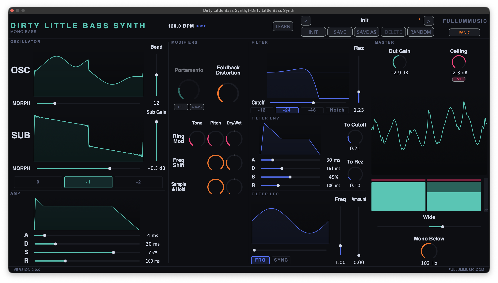

# Dirty Little Bass Synth

[](https://github.com/RFullum/DirtyLittleBassSynth/releases/latest)



The Dirty Little Bass Synth is a monophonic wavetable Bass synth designed to get big, disgustingly aggressive Bass tones quickly.

---

## System Requirements

**macOS**

- macOS 11 (Big Sur) or later
- Universal binary (Apple Silicon + Intel)
- Formats: **VST3**, **AU**, **Standalone**

**Linux**

- 64-bit x86_64 distribution with **glibc 2.38 or newer**. The build is produced
  on Debian 13 (trixie); current/recent distros (Debian 13, Ubuntu 24.04+, recent
  Fedora/Arch) work, but older releases (e.g. Ubuntu 22.04, Debian 12) ship an
  older glibc and will not load it.
- A standard desktop audio/GUI stack (ALSA or JACK, X11, FreeType, Fontconfig) plus
  OpenGL for the animated visualisers — present on any typical desktop Linux.
- Formats: **VST3**, **Standalone** (no AU — that format is macOS-only)
- ARM (aarch64) Linux is not currently provided; the build is x86_64 only.

**Windows**

- 64-bit Windows 10 or 11 (x64).
- Self-contained — the Visual C++ Redistributable is **not** required (the MSVC
  runtime is statically linked into the plug-in and Standalone).
- Formats: **VST3**, **Standalone** (no AU — that format is macOS-only)
- ARM (aarch64) Windows is not currently provided; the build is x64 only.

---

## Download

Grab the latest build from the [Releases page](https://github.com/RFullum/DirtyLittleBassSynth/releases/latest).

**macOS** — the `.pkg` installs the VST3, AU, and Standalone. Signed and notarized.

**Linux** — two tarballs are provided:

- **VST3** — extract into your personal VST3 folder, then rescan plug-ins in your DAW:

  ```sh
  mkdir -p ~/.vst3
  tar -xzf DirtyLittleBassSynth-2.0.1-Linux-x86_64.vst3.tar.gz -C ~/.vst3
  ```

  For a system-wide install, extract into `/usr/lib/vst3` instead (needs `sudo`).

- **Standalone** — extract anywhere and run the executable. Keep the bundled
  `Patches/` folder next to the binary so the factory patches load:

  ```sh
  tar -xzf DirtyLittleBassSynth-2.0.1-Linux-x86_64.Standalone.tar.gz
  cd "Dirty Little Bass Synth"
  ./"Dirty Little Bass Synth"
  ```

See the System Requirements above for the glibc baseline.

**Windows** — two zips are provided:

- **VST3** — download `…-Windows-x86_64.vst3.zip` and extract the
  `Dirty Little Bass Synth.vst3` folder into the standard system VST3 directory:

  ```
  C:\Program Files\Common Files\VST3\
  ```

  Right-click the zip → **Extract All…**, then move the extracted
  `Dirty Little Bass Synth.vst3` folder into that location (you'll be prompted
  for administrator permission, since it's under `Program Files`). Rescan
  plug-ins in your DAW. Because the build is unsigned, your browser may warn the
  zip is "not commonly downloaded" — choose **Keep**. If extraction is blocked,
  right-click the zip → **Properties** → tick **Unblock** → **OK** first.

- **Standalone** — download `…-Windows-x86_64.Standalone.zip` and extract
  anywhere. Run `Dirty Little Bass Synth.exe`, keeping the bundled `Patches/`
  folder next to it so the factory patches load.

---

## Where files land after install

**macOS**

- VST3 → `/Library/Audio/Plug-Ins/VST3/Dirty Little Bass Synth.vst3`
- AU → `/Library/Audio/Plug-Ins/Components/Dirty Little Bass Synth.component`
- Standalone → `/Applications/Dirty Little Bass Synth.app`

User patches live at:
`~/Library/Application Support/FullumMusic/Dirty Little Bass Synth/Patches/`

**Linux**

- VST3 → `~/.vst3/Dirty Little Bass Synth.vst3` (or `/usr/lib/vst3/` system-wide)
- Standalone → wherever you extracted it

User patches live at:
`~/.config/FullumMusic/Dirty Little Bass Synth/Patches/`

**Windows**

- VST3 → `C:\Program Files\Common Files\VST3\Dirty Little Bass Synth.vst3`
- Standalone → wherever you extracted it

User patches live at:
`%APPDATA%\FullumMusic\Dirty Little Bass Synth\Patches\`

Factory patches travel inside the VST3 bundle (and beside the Standalone binary) and are read-only.

---

## Title Bar

### Plugin Name (DIRTY LITTLE BASS SYNTH)

Hover for a hint. **Right-click** to open the app menu:

- **Show Tooltips** (F1) — toggle hover-help text on every control.
- **Echo CCs to Controller** (standalone only) — sends CC messages back to your MIDI controller when you move a mapped control via the UI or load a patch. Useful for motorized faders and LED-ring encoders.

### BPM Display

Shows the current tempo with an **INT** badge (standalone) or **HOST** badge (plugin in a DAW).

In standalone: drag the BPM number up/down to change it (Shift = fine). Double-click to type a value.

### LEARN

Click to enter MIDI Learn mode. The body of the synth dims and intercepts clicks.

- **Left-click** a control to arm it, then send a CC from your controller to bind. The control shows its mapped CC# as a small badge.
- **Right-click** a mapped control to unmap.
- **CLEAR MAPS** wipes every binding.

Click LEARN again to exit. Mappings persist globally across sessions. In standalone, CC1 is mapped to Filter LFO Amount by default.

### Patch Controls

Top row: prev/next arrows around the current patch name. **Click the patch name** to open a grid popup of all factory + user patches. Factory patches are read-only (teal); user patches are editable (purple). A `*` after the name = unsaved changes.

Bottom row:

- **INIT** — load the default initialised state.
- **SAVE** — overwrite the current user patch. Disabled on factory + Init.
- **SAVE AS** — name a new patch and write it to your user folder.
- **DELETE** — remove the current user patch (confirmation prompt). Disabled on factory + Init.
- **RANDOM** — randomise every parameter.

You can also drag a `.dlbs` file from Finder onto the patch area to import.

Standalone keyboard shortcuts: **Cmd+S** = SAVE, **Cmd+Shift+S** = SAVE AS.

### PANIC

Hard-stops every active voice. Use when a stuck note slips through.

---

## Oscillators Column

### Oscillator

- **MORPH** slider — morphs between Sine, Spike, and Sawtooth.
- **Bend** vertical slider — pitch-bend range, 0–24 semitones.

The visualiser above the morph slider shows the current waveshape.

### Sub Oscillator

- **MORPH** slider — morphs between Sine, Square, and Sawtooth.
- **Sub Gain** vertical slider — sub-osc gain in dB, −∞ to 0 dB.
- **0 / -1 / -2** buttons — sub octave relative to the main oscillator.

### Amp

ADSR envelope applied to both Osc and Sub:

- **A** — attack time
- **D** — decay time
- **S** — sustain level
- **R** — release time

The envelope shape visualiser above the sliders previews the current shape.

---

## Modifiers Column

The dry/wet knobs blend with the main Osc only — the Sub bypasses everything in this column. Dry/wet rotaries support **double-click = 0%**, **shift-click = 50%**, **Cmd-click = 100%**.

The chain order is **Foldback → Ring Mod → Freq Shift → Sample & Hold**.

### Portamento

Rotary glide time (instant to ~1 s). Two mode buttons below:

- **OFF / ON** — engages portamento.
- **ALWAYS / LEGATO** — glide on every note vs. only on overlapping notes.

When off, the knob dims but stays interactive so you can preset a time.

### Foldback Distortion

Rotary adds harmonic content by folding the Osc waveform back on itself. Affects only the main Osc.

### Ring Mod / Freq Shift / Sample & Hold

Three rows sharing a common column layout:

- **Tone** (Ring Mod only) — morphs the carrier between Sine and Square.
- **Pitch** — modifier frequency relative to the played note. −2 to +2 octaves, centre = unison.
- **Dry/Wet** — blends the modified signal with everything upstream in the chain.

Sample & Hold's Pitch counterclockwise produces heavy bit-crushing; fully counterclockwise produces a square-like waveform an octave down.

---

## Filter Column

### Filter

- Filter type buttons: **-12dB / -24dB / -48dB / Notch**.
- **Cutoff** horizontal slider below the visualiser.
- **Rez** (resonance) vertical slider to the right.

The filter visualiser animates in real time as the envelope and LFO modulate the cutoff and resonance.

### Filter Env

- **A / D / S / R** sliders — ADSR for the filter envelope.
- **To Cutoff** knob — how much the envelope pushes the cutoff.
- **To Rez** knob — how much the envelope pushes resonance.

### Filter LFO

- Shape morph slider below the visualiser — Sine, Square, Saw.
- **Freq** vertical slider — LFO speed.
- **Amount** vertical slider — how much the LFO drives the cutoff.
- **FRQ / SYNC** toggle — FRQ uses the Freq slider in Hz; SYNC swaps the slider for a tempo-synced subdivision picker that locks to the host or standalone BPM.

---

## Master Column

### Out Gain

Rotary master output gain, in dB.

### Ceiling Limiter

- **Ceiling** rotary — limiter ceiling in dB.
- **ON / OFF** button — bypass the limiter.

A gain-reduction meter sits beside the output meter (below) showing how hard the limiter is working.

### Scope

Oscilloscope of the post-master output.

### Output Meter

Stereo level meter with a clip strip at the top of each channel. Clip strips latch red whenever a sample crosses 0 dBFS.

### Wide

Bipolar Haas-style stereo widener. Centre = mono. The further from centre, the wider the stereo image.

### Mono Below

Crossover frequency rotary. Frequencies below this are summed to mono.

---

## Tooltips

Hover any control to see its description. Toggle on/off via the title-bar right-click menu, or **F1** in standalone.

---

## Building from Source

Requires CMake ≥ 3.22 and a C++20 compiler. JUCE is vendored as a git submodule.

Clone with submodules:

```sh
git clone --recurse-submodules https://github.com/RFullum/DirtyLittleBassSynth.git
cd DirtyLittleBassSynth
```

If you already cloned without `--recurse-submodules`:

```sh
git submodule update --init --recursive
```

### macOS

The signed, notarized release is built with Projucer + Xcode from `Wavetable5.jucer`
(see `scripts/package-and-notarize.sh`). The CMake presets below also build on macOS
for local development (without signing):

```sh
cmake --preset=macos
cmake --build --preset=macos-release
```

### Linux

Uses the Ninja Multi-Config generator with the system compiler (GCC). Install the
JUCE build dependencies first (Debian/Ubuntu names shown):

```sh
sudo apt install build-essential ninja-build cmake \
    libasound2-dev libjack-jackd2-dev \
    libfreetype-dev libfontconfig1-dev \
    libx11-dev libxext-dev libxinerama-dev libxrandr-dev libxcursor-dev \
    libxcomposite-dev libxrender-dev libgl-dev libcurl4-openssl-dev
```

Configure and build the released formats:

```sh
cmake --preset=linux
cmake --build --preset=linux-release --target DirtyLittleBassSynth_VST3 DirtyLittleBassSynth_Standalone
```

The VST3 installs to `~/.vst3/Dirty Little Bass Synth.vst3`; the Standalone and its
`Patches/` folder land in
`build/linux/DirtyLittleBassSynth_artefacts/Release/Standalone/`. For development
iteration, use `--preset=linux-debug` instead.

### Windows

Requires **Visual Studio 2026** (the v18 toolset) with the *Desktop development
with C++* workload. The bundled CMake works — either add it to your `PATH` or
run from a *Developer PowerShell for VS*. Both the plug-in and the Standalone
link the MSVC runtime statically, so the artefacts need no Visual C++
Redistributable.

Configure and build the released formats:

```powershell
cmake --preset=windows
cmake --build --preset=windows-release --target DirtyLittleBassSynth_VST3 DirtyLittleBassSynth_Standalone
```

The build does **not** auto-install on Windows (the system VST3 folder needs
admin rights). The artefacts land under
`build\windows\DirtyLittleBassSynth_artefacts\Release\` — copy the VST3 into
`C:\Program Files\Common Files\VST3\` yourself, or load it from the build tree in
your DAW. The Standalone `.exe` and its `Patches/` folder sit in the `Standalone\`
subfolder. For development iteration, use `--preset=windows-debug`.
